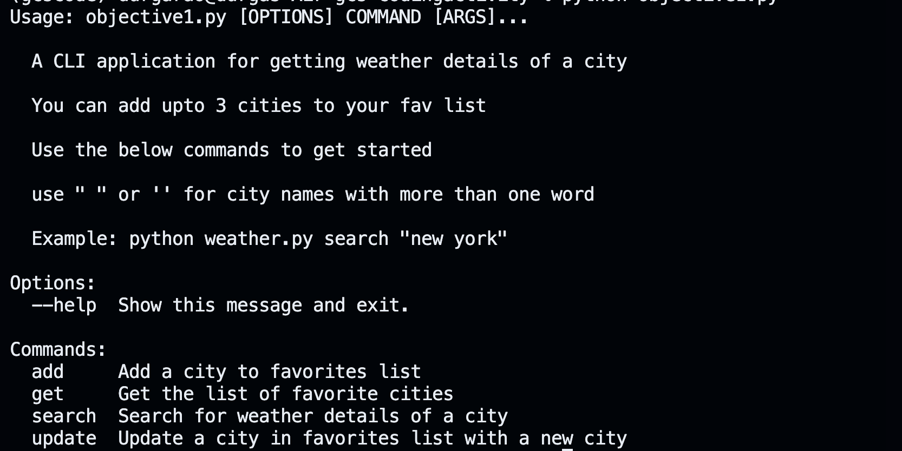
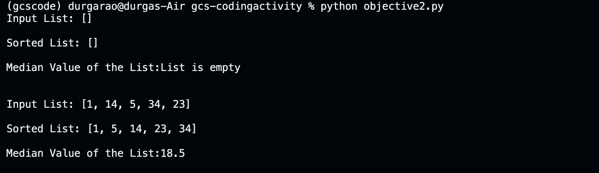

# This repository contains solutions to objectives 1 and 2 of the Coding Challenge

## Objective 1

The file favorites.json contains the list of favorite cities. The file is updated when a city is added or updated.
The file objective1.py contains the code for objective 1. The code is written in Python 3.12.0.

## Setup instructions

Create a `.env` file in the root directory of the project and add the following lines to it:
```OPEN_WEATHER_API_KEY = "your api key"```

```pip install -r requirements.txt```  # To install all the dependencies

The code can be run in the terminal by typing the following command:

```python objective1.py```

Output:


Sample commands:

```python objective1.py search "city name"```   # To get weather details of a city

```python objective1.py get```  # To get weather details of all cities in your fav list

```python objective1.py add "city name"```   # To add a city to your fav list

```python objective1.py update "old_city_name" "new_city_name"```   # To update a city in your fav list

Output Sample:

input commmand:   ```python objective1.py search "New Jersey"```


## Objective 2

The file objective2.py contains the code for objective 2. The code is written in Python 3.12.0. The code can be run in the terminal by typing the following command:

```python objective2.py```

Output:

